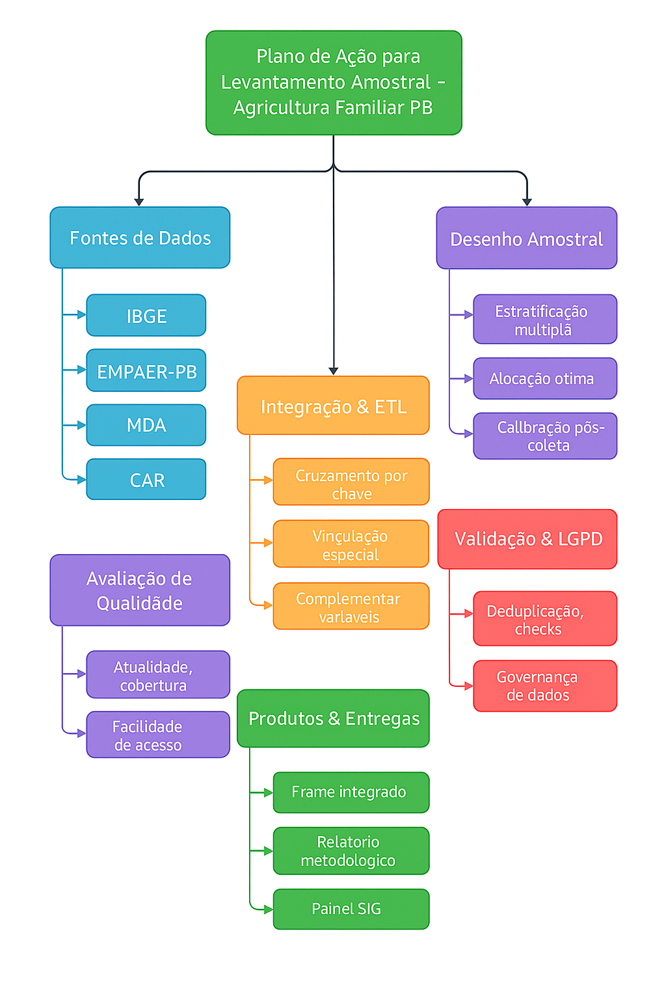

# Levantamento Amostral da Agricultura Familiar na Paraíba


---

## 1. Visão Geral do Projeto

Este repositório contém um conjunto completo de ferramentas e análises para a realização de um **levantamento amostral sobre a agricultura familiar no estado da Paraíba**. O projeto foi desenvolvido como um exercício acadêmico para a disciplina de Amostragem, aplicando práticas profissionais de engenharia de dados, desenvolvimento de software e análise estatística.

O objetivo principal é fornecer uma estrutura metodológica e técnica robusta para planejar, executar e analisar uma pesquisa por amostragem complexa, desde a integração de fontes de dados heterogêneas até a inferência estatística e a apresentação dos resultados.

O projeto abrange todas as **12 etapas de um levantamento amostral** descritas por Cochran (1977), demonstrando um fluxo de trabalho completo e reprodutível.

---

## 2. Principais Componentes

Este projeto é composto por quatro módulos principais, cada um com um propósito específico dentro do fluxo de trabalho de uma pesquisa amostral.

| Módulo | Tecnologia | Descrição |
| :--- | :--- | :--- |
| **Pipeline de ETL** | `Python` / `R` | Scripts para **Extração, Transformação e Carga** de dados de múltiplas fontes (IBGE/SIDRA, EMPAER, CAF), realizando limpeza, padronização, deduplicação e integração em um *data frame* unificado. |
| **Cálculo Amostral** | `R Shiny` | Uma **aplicação web interativa** para calcular o tamanho da amostra necessário para estimar proporções, com ajuste para populações finitas e parâmetros customizáveis. |
| **Análise Inferencial** | `Python` / `R` | Scripts para realizar **análise estatística** sobre os dados coletados, incluindo estatísticas descritivas, estimação por intervalos de confiança e testes de hipóteses. |
| **Documentação** | `Markdown` / `PDF` | Manuais técnicos, relatórios metodológicos e de análise que garantem a **reprodutibilidade e a transparência** de todo o processo. |

---

## 3. Estrutura do Repositório

O repositório está organizado de forma a separar lógica, dados, documentação e resultados, seguindo as melhores práticas de gerenciamento de projetos de ciência de dados.

```
.seu_projeto/
├── .gitignore
├── LICENSE
├── README.md                          # Documentação principal do projeto
├── config.yaml                          # Arquivo de configuração para os pipelines de ETL
|
├── etl/                                 # Módulo de Extração, Transformação e Carga
│   ├── etl_integrador.py               # Script ETL em Python
│   └── etl_integrador.R                # Script ETL em R
|
├── dados/                               # Dados do projeto (não versionados)
│   ├── raw/                            # Dados brutos (ex: arquivos .csv da EMPAER, CAF)
│   └── processed/                      # Dados processados e integrados
│       └── frame_integrado.csv         # Saída final do ETL
|
├── analise/                             # Módulo de análise estatística
│   ├── codigo_inferencia_python.py     # Script de análise inferencial em Python
│   └── codigo_inferencia_R.R           # Script de análise inferencial em R
|
├── app_shiny/                           # Módulo da aplicação de cálculo amostral
│   ├── app.R                           # Código-fonte da aplicação Shiny
│   └── README.md                       # Instruções específicas da aplicação
|
└── docs/                                # Documentação e relatórios gerados
    ├── Manual_ETL_Integracao_Python_A4.pdf
    ├── Manual_ETL_Integracao_R_A4.pdf
    ├── Amostragem_Estatística.pdf      # Relatório técnico da aplicação Shiny
    ├── relatorio_inferencia.md         # Relatório da análise inferencial (gerado automaticamente)
    ├── qc_reports/                     # Relatórios de controle de qualidade
    │   └── qc_frame_integrado.md
    ├── logs/
    │   └── etl.log
    └── img/                            # Gráficos e visualizações (gerados automaticamente)
        ├── renda_por_regiao.png
        └── uso_credito.png
```

---

## 4. Metodologia

O projeto segue rigorosamente as etapas de um levantamento amostral, conforme proposto por Cochran (1977). O plano de ação completo pode ser visualizado no diagrama abaixo, que orientou todo o desenvolvimento.

  
*Substitua `docs/img/plano_de_acao.png` pelo caminho correto da sua imagem do plano de ação.*

---

## 5. Instalação e Pré-requisitos

Para executar os componentes deste projeto, você precisará ter **R** e/ou **Python** instalados, além das bibliotecas listadas abaixo.

### Ambiente R (`>= 4.2`)

Instale as bibliotecas necessárias executando o seguinte comando no console do R:

```r
install.packages(c("shiny", "dplyr", "readr", "stringr", "httr", "ggplot2", "knitr", "yaml"))
```

### Ambiente Python (`>= 3.9`)

Recomenda-se o uso de um ambiente virtual. Instale as bibliotecas com `pip`:

```bash
pip install pandas numpy scipy matplotlib seaborn pyyaml requests
```

---

## 6. Como Executar o Projeto

### a) Pipeline de ETL

O pipeline de ETL integra os dados brutos e gera o `frame_integrado.csv`.

1.  **Configure:** Edite o arquivo `config.yaml` para ajustar os caminhos dos arquivos de entrada e outros parâmetros.
2.  **Execute:** Escolha a versão em R ou Python.

    ```bash
    # Para executar com R
    Rscript etl/etl_integrador.R

    # Para executar com Python
    python3 etl/etl_integrador.py
    ```

    A execução bem-sucedida criará o arquivo `dados/processed/frame_integrado.csv`, além de logs e relatórios de qualidade em `docs/`.

### b) Aplicação de Cálculo Amostral

A aplicação Shiny permite calcular o tamanho da amostra de forma interativa.

1.  **Navegue** até o diretório `app_shiny/`.
2.  **Execute** o seguinte comando no console do R:

    ```r
    shiny::runApp()
    ```

    A aplicação será aberta no seu navegador padrão.

### c) Análise Inferencial

Os scripts de análise geram estatísticas, gráficos e um relatório completo em Markdown.

1.  **Pré-requisito:** Certifique-se de que o arquivo `dados/processed/frame_integrado.csv` existe.
2.  **Execute:** Escolha a versão em R ou Python.

    ```bash
    # Para executar com R
    Rscript analise/codigo_inferencia_R.R

    # Para executar com Python
    python3 analise/codigo_inferencia_python.py
    ```

    Ao final, o relatório `docs/relatorio_inferencia.md` e os gráficos em `docs/img/` serão gerados ou atualizados.

---

## 7. Resultados e Documentação

Os principais resultados e a documentação técnica estão localizados na pasta `docs/`.

-   **[Manual de Integração ETL (Python)](docs/Manual_ETL_Integracao_Python_A4.pdf):** Detalha a arquitetura e o funcionamento do pipeline de ETL em Python.
-   **[Manual de Integração ETL (R)](docs/Manual_ETL_Integracao_R_A4.pdf):** Detalha a arquitetura e o funcionamento do pipeline de ETL em R.
-   **[Relatório de Análise Inferencial](docs/relatorio_inferencia.md):** Apresenta os resultados estatísticos, incluindo intervalos de confiança, testes de hipóteses e conclusões.
-   **[Relatório Técnico do Cálculo Amostral](docs/Amostragem_Estatística.pdf):** Descreve as fórmulas e a implementação da aplicação Shiny.

---

## 8. Contribuição

Este é um projeto acadêmico, mas contribuições são bem-vindas. Se você tiver sugestões para melhorar o código, a metodologia ou a documentação, sinta-se à vontade para abrir uma **Issue** ou enviar um **Pull Request**.

Por favor, leia o arquivo `CONTRIBUTING.md` para mais detalhes sobre o processo.

---

## 9. Autor

-   **Diogo Da Silva Rego**
    -   E-mail: `[diogo.silva.rego@academico.ufpb.br]`
    -   LinkedIn: `[diogorego]`
    

---

## 10. Licença

Este projeto está licenciado sob a **Licença MIT**. Veja o arquivo [LICENSE](LICENSE) para mais detalhes.
